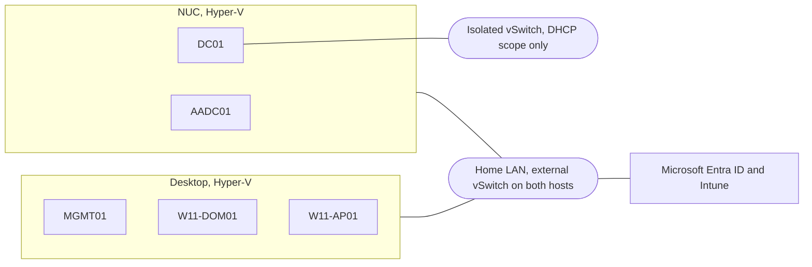
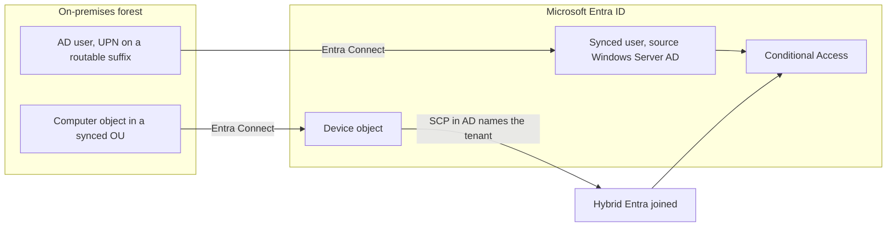

# Microsoft 365 hybrid identity and Intune lab

A self-funded lab built to practise the things a Modern Workplace role actually asks for: Windows
Autopilot provisioning, Intune policy design, Conditional Access, and hybrid identity between an
on-premises Active Directory forest and Microsoft Entra ID.

Everything here runs on a single Microsoft 365 Business Premium licence plus two machines already
owned. Domain names, account names and tenant identifiers have been replaced with placeholders
throughout.

---

## What it demonstrates

| Area | What was built |
| --- | --- |
| **Hybrid identity** | Entra Connect with password hash synchronisation, custom OU filtering, and the service connection point that makes hybrid join possible. Verified with `AzureAdPrt : YES` on a domain-joined client |
| **Autopilot** | A Windows 11 device provisioned end to end: hardware hash capture, group tag, dynamic device group, deployment profile, Enrolment Status Page |
| **Intune policy** | Configuration and security policies reconciled setting by setting against the Microsoft security baseline for Windows, so no two profiles fight over the same CSP node |
| **Endpoint security** | BitLocker with recovery escrow, Defender for Endpoint EDR onboarding, and a compliance policy driven by device risk score |
| **Conditional Access** | A baseline with break-glass exclusion, built after disabling Security Defaults, and enabled in ascending order of blast radius |
| **Active Directory** | Server 2025 Core domain controller running AD DS, DNS with forwarders, DHCP scoped to an isolated segment, and File and Storage Services, with an OU design that survives contact with sync filtering |
| **Group Policy** | Preferences with item-level targeting, mapping a file share conditionally on security group membership |

---

## Topology

Two physical hosts. Servers run on a small NUC, clients on a desktop. Both are bridged onto the same
LAN, which is what lets the clients reach the domain controller across hosts.

**Why DHCP is on an isolated switch.** A DHCP server on the home LAN would race the household
router and hand out addresses to phones and TVs. Binding the scope to a second, isolated virtual
switch means the role can be built, authorised and tested properly with no chance of it answering a
real client.

---

## Machines

| Host | VM | Role | RAM |
| --- | --- | --- | --- |
| NUC | `DC01` | Server 2025 **Core**, running AD DS, DNS, DHCP and File and Storage Services | 2 GB |
| NUC | `AADC01` | Server 2025 Desktop, running Entra Connect, which is not supported on Core | 4 GB |
| Desktop | `MGMT01` | Server 2025 Desktop, running GPMC and RSAT | 4 GB |
| Desktop | `W11-DOM01` | Windows 11, domain joined and then hybrid Entra joined | 4 GB |
| Desktop | `W11-AP01` | Windows 11, the Autopilot target, Entra joined | 4 GB |

The domain controller runs Core deliberately. It is leaner, and administering it over PowerShell and
remote tooling is the more useful habit.

`MGMT01` exists so that domain administrator credentials are never entered on an end user
workstation. Installing RSAT on the Windows 11 client would have been quicker, but it puts a Tier 0
credential on a Tier 2 machine, which is exactly what tiered administration exists to prevent.

---

## Identity flow

Two details in that diagram carry most of the difficulty.

**The UPN suffix.** An internal AD domain such as `corp.example.internal` cannot be verified in
Entra. Without an alternative UPN suffix on a domain that is verified, every synced user silently
arrives as `name@tenant.onmicrosoft.com` and nothing matches. Most real migrations meet this,
because their forest is `.local`.

**The computer object.** Hybrid join needs the device to exist in Entra before it can register, and
that only happens if its computer object sits inside an OU the sync filter includes. It is why
domain joins in this lab specify `-OUPath` rather than letting machines default to `CN=Computers`,
a container no sync filter can select.

---

## Documentation

| Document | Contents |
| --- | --- |
| [`docs/architecture.md`](docs/architecture.md) | Design decisions and the reasoning behind them |
| [`docs/build-notes.md`](docs/build-notes.md) | Failures encountered and what actually caused them |

---

## Roadmap

Not built yet, listed so the scope of what is built stays unambiguous:

- **Autopilot device preparation (v2).** Only v1 is deployed. Testing v2 needs a separate device,
  since a v1 profile takes precedence where both apply
- **Hybrid Autopilot.** Provisioning straight into a hybrid join via the Intune Connector for Active
  Directory. Entra-joined Autopilot and hybrid-joined domain clients both work today, but the
  combination does not
- **Seamless SSO.** Enabled in the Entra Connect wizard, but the Group Policy that publishes the SSO
  endpoints to the intranet zone has not been deployed, so it is not working end to end
- **Automatic MDM enrolment for hybrid devices.** `W11-DOM01` is hybrid Entra joined but not
  enrolled in Intune, so no configuration or compliance policy reaches it. That needs the *Enable
  automatic MDM enrollment using default Azure AD credentials* Group Policy
- **Enrolment restrictions.** Not configured
- **A sysprepped golden image**, for building further distinct devices quickly
- **Operational routines.** Sync monitoring, a checkpoint and revert cycle, and patching. The lab
  runs, but it is not yet operated to a schedule
